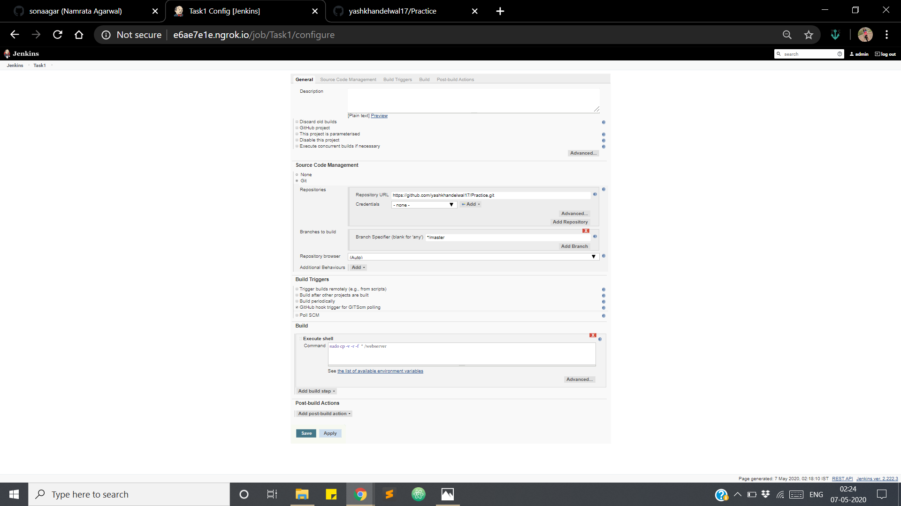
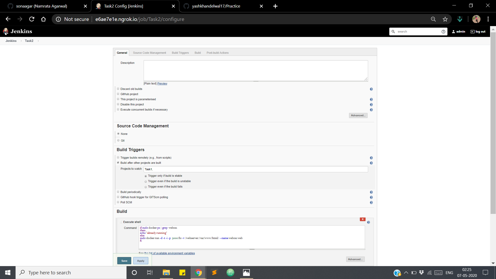
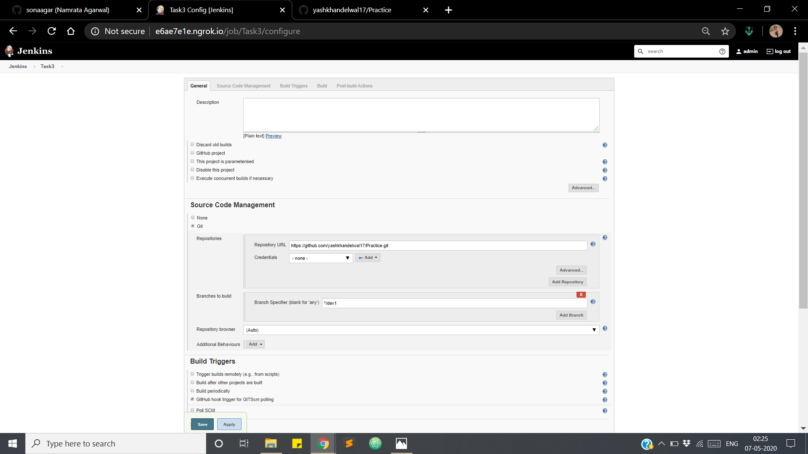
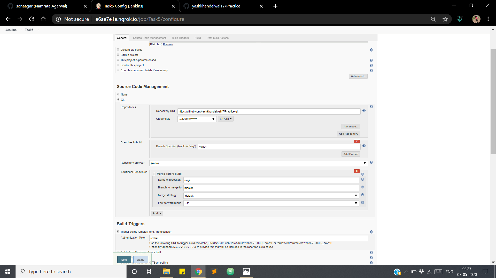
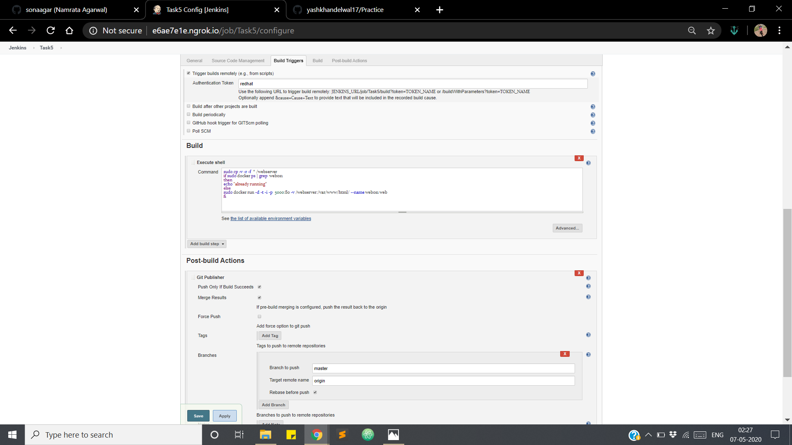

# Automate the process for main and test environment
## Task1: copying the code of main environment
```
SCM>git>repository URL:url of repo
build triggers>enable github hook trigger for GITScm polling
build>execute shell>sudo cp -v -r -f  * /webserver
save
```

## Task2: deploying using docker in production environment
```
SCM>none
Build triggers>enable Build after other projects are built>project to watch:job1
Buid>execute shell>command:
if sudo docker ps | grep  webos1
then 
echo "already running"
else
sudo docker run -d -t -i -p  5000:80 -v /webserver:/var/www/html/ --name webos1 web 
fi

save
```

## Task3:copying the code of test environment
```
SCM>git>repository URL:url of repo>Branches to build: */dev1
build triggers>enable github hook trigger for GITScm polling
build>execute shell>sudo cp -v -r -f  * /webserver1
save
```

## Task4:depolying using docker in testing environment
```
SCM>none
Build triggers>enable Build after other projects are built>project to watch:job3
Buid>execute shell>command:
if sudo docker ps | grep testos
then 
echo "already running"
else
sudo docker run -d -t -i -p  6000:80 -v /webserver1:/var/www/html/ --name testos web
fi

save
```

## Task5: merging dev1 code with master when QAT team certifies
```
SCM>git>repository url:url of your repo
credentials>usrname/password
branch specifier> */dev1
Additional Behaviours>
name of repo: origin
branch to merge to: master
merge strategy:default
ffmode
Build triggers> enable trigger builds remotely> set authentication token (password)
(copy the url  which when run will trigger the job , replace jenkin_url with url of jenkin and token_name with password)
Build >execute shell>command:
sudo cp -v -r -f  * /webserver
if sudo docker ps | grep  webos1
then 
echo "already running"
else
sudo docker run -d -t -i -p  5000:80 -v /webserver:/var/www/html/ --name webos1 web 
fi
Post-build actions:
enable Push only, merge results
branches: branch to push : master
target remote name:origin
enable rebase before push
save
```


```
@all-contributors bot!
```
